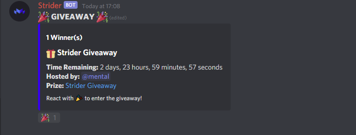

# Giveaways Commands

## Giveaways


MANAGE\_MESSAGES Permissions Required To Start/End A Giveaway


<table>
  <thead>
    <tr>
      <th style="text-align:left">Command</th>
      <th style="text-align:left">Description</th>
    </tr>
  </thead>
  <tbody>
    <tr>
      <td style="text-align:left"><code>$gstart</code>
      </td>
      <td style="text-align:left">
        
Opens The Interactive Giveaway Maker, Our New

        
<a href="https://dash.striderbot.net"><b>Online Giveaway Manager</b></a> Is
          Coming Soon!

      </td>
    </tr>
    <tr>
      <td style="text-align:left"><code>$greroll (Message ID)</code>
      </td>
      <td style="text-align:left">Reroll A Giveaway</td>
    </tr>
    <tr>
      <td style="text-align:left"><code>$gend (Message ID)</code>
      </td>
      <td style="text-align:left">End A Giveaway</td>
    </tr>
    <tr>
      <td style="text-align:left"><code>$gedit (Message ID)</code>
      </td>
      <td style="text-align:left">Edit A Giveaway</td>
    </tr>
  </tbody>
</table>

### Giveaway Requirements So Far

* Messages \(Coming Soon\)
* Server Join \(Coming Soon\)
* + Much More 

## Drops

| Command | Description |
| :--- | :--- |
|  |  |

