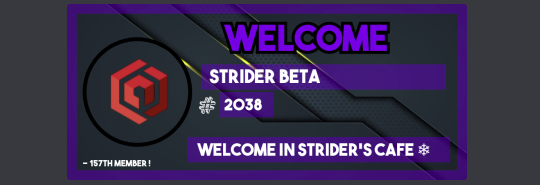
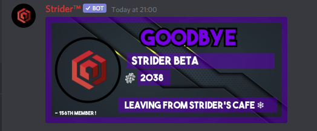

# Logging/Settings Commands

## Logging Modules

| Command | Description |
| :--- | :--- |
| `$logs-enable all <#Channel>` | Enable All Logging Modules |
| `$logs-enable server <#Channel>` | Enable Server Updates Logging |
| `$logs-enable emoji <#Channel>` | Enable Emoji Updates Logging |
| `$logs-enable Role <#Channel>` | Enable Role Updates Logging |
| `$logs-enable member <#Channel>` | Enable Member Updates Logging |
| `$logs-enable mod <#Channel>` | Enable Mod Updates Logging |
| _**Disable Commands**_ | _**Description**_ |
| `$logs-disable server` | Disable Server Updates Logging |
| `$logs-disable emoji` | Disable Emoji Updates Logging |
| _\*\*_`$logs-disable Role` | Disable Role Updates Logging |
| `$logs-disable member` | Disable Member Updates Logging |
| `$logs-disable mod` | Disable Mod Updates Logging |

### Logged Server Events

Channel Creation, Channel Deletion, Guild Ban Add, Guild Ban Remove, Join Logging, Leave Logging, Kicks, Role Changes, Deleted Messages, Role Creation, Role Modification, Role Deletion. \(More Coming Soon!\)

## Welcome/Leave Messages

| Command | Description |
| :--- | :--- |
| `$welch enable <#Channel>` | Enables Welcome Messages To Channel |
| `$welch disable` | Disable The Welcome Messages |
| `$leavech enable <#Channel>` | Enable The Leave Message |
| `$leavech disable` | Disable The Leave Messages |
|  |  |

### _Striders Welcome/Leave Messages_

## Level Up Messages 

| Command | Description |
| :--- | :--- |
| `$level-up-messages enable <#Channel>` | Enables Leave Up Messages |
| `$level-up-messages disable` | Disables Leave Up Messages |

